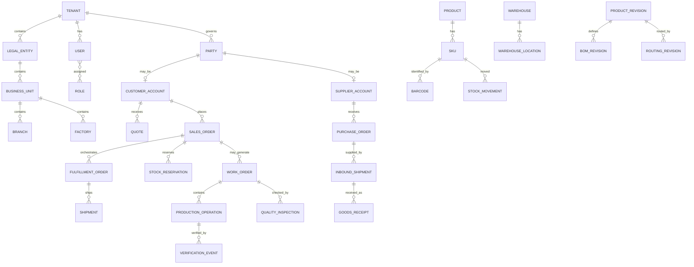

# Canonical Data Model

## Universal conventions
Every transactional aggregate carries immutable ID, tenant ownership, timestamps/actor, explicit lifecycle state and optimistic version where contention matters. No customer-specific columns.

Money is decimal + explicit currency. Quantities are decimal + UOM. Instants stored UTC; sites retain business timezone. External identities use governed mapping, not random provider columns.

## Inventory truth
Authoritative inputs: immutable StockMovement, StockReservation and inventory status dimensions (available/QC/damaged/blocked/lot/serial/location). Derived: on hand, reserved, available, incoming, QC hold.

## Product vs engineering
PIM Product/SKU = commercial/logistics identity. ENG ProductRevision/BOM/Routing = engineering/manufacturing definition. Configured order lines reference a released revision or an immutable order-specific specification.

## Party
Canonical Party prevents duplicate customer/supplier/contact universes; role-specific data belongs in customer/supplier profiles.

## Documents
Rendered PDF is evidence/output, not business truth. Preserve template version, source aggregate, rendered hash and issued snapshot.

## Audit vs events
Audit answers who changed what/from-to/when/source. Business events answer what business fact occurred. Audit is not the event bus.
