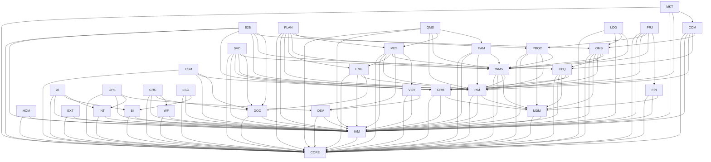

# Domain Dependency Graph

Dependencies indicate allowed knowledge/use of public contracts, not permission for direct table writes.

## Rule
A cycle between business domains is an architecture smell. Resolve with smaller shared primitive, application event, orchestration or an ADR; do not create mutual repository imports.
